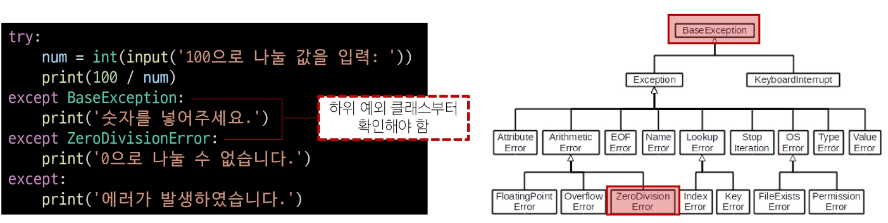

# 예외

# 1. 에러와 예외

## 1) 디버깅

### (1) 버그(bug)

- 버그
    - 소프트웨어에서 발생하는 오류 또는 결함
    - 프로그램의 예상된 동작과 실제 동작 사이의 불일치
- 버그의 기원
    - 최초의 버그는 1945년 프로그래밍 언어의 일종인 코볼 발명자 그레이스 호퍼가 발견
    - 역사상 최초의 컴퓨터 버그는 Mark II 라는 컴퓨터 회로에 벌레인 나방이 들어가 합선을 일으켜 비정상적으로 동작한 것을 기록한 것
    - “버그”라는 용어는 이전부터 사용되어 왔지만 이 사건을 계기로 컴퓨터 시스템에서 발생하는 오류 또는 결함을 지칭하는 용어로 널리 사용되기 시작

### (2) 디버깅 (Debugging)

- 디버깅
    - 소프트웨어에서 발생하는 버그를 찾아내고 수정하는 과정
    - 프로그램의 오작동 원인을 식별하여 수정하는 작업
- 디버깅 방법
    1. print 함수 활용
        - 특정 함수 결과, 반복/조건 결과 등 나눠서 생각, 코드를 bisection으로 나눠서 생각
    2. 개발 환경(text editor, IDE) 등에서 제공하는 기능 활용
        - breakpoint, 변수 조회 등
    3. Python tutor 활용 (단순 파이썬 코드인 경우)
    4. 뇌 컴파일, 눈 디버깅 등

## 2) 에러

- 에러 (Error) : 프로그램 실행 중에 발생하는 예외 상황

### (1) 파이썬의 에러 유형

- 문법 에러(Syntax Error) : 프로그램의 구문이 올바르지 않은 경우 발생 (오타, 괄호 및 콜론 누락 등의 문법적 오류)

```python
# invalid syntax (문법 오류)
while # SyntaxError: invalid syntax

#assign to literal (잘못된 할당)
5=3 # SyntaxError: cannot assign to literal (잘못된 할당)

# EOL (End of Line)
print('hello # SyntaxError: EOL while scanning string literal

# EOF (End of File)
print(   # SyntaxError: unexpected EOF while parsing
```

- 예외(Exception) : 프로그램 실행 중에 감지되는 에러

## 3) 예외

- 예외(Exception) : 프로그램 실행 중에 감지되는 에러

### (1) 내장 예외

- 예외 상황을 나타내는 예외 클래스들

⇒  파이썬에서 이미 정의되어 있으며, 특정 예외 상황에 대한 처리를 위해 사용

- ZeroDivisionError : 나누기 또는 모듈로 연산의 두 번째 인자가 0일 때 발생
- NameError : 지역 또는 전역 이름을 찾을 수 없을 따 발생
- TypeError
    - 타입 불일치, 인자 누락, 인자 초과, 인자 타입 불일치
- ValueError
    - 연산이나 함수에 문제가 없지만 부적절한 값을 가진 인자를 받았고, 상황이 InedxError 처럼 더 구체적인 예외로 설명되지 않는 경우 발생
- IndexError : 시퀀스 인덱스가 범위를 벗어날 때
- KeyError : 딕셔너리에 해당 키가 존재하지 않을 때
- ModuleNotFoundError : 모듈을 찾을 수 없을 때
- ImportError : import 하려는 이름 찾을 수 없을 때
- KeyboardInterrupt : 사용자가 Ctrl+C 또는 Delete키 누를 때 ⇒ 무한 루프 강제 종료
- IndentationError : 잘못된 들여쓰기와 관련

```python
# ZeroDivisionError
10/0 # ZeroDivisionError: division by zero

# NameError
print(name_error) # NameError: name 'name_error' is not defined

# TypeError
	# 타입 불일치
'2' + 2  # TypeError: can only concatenate str (not "int") to str
 # 인자 누락
sum()  # TypeError: sum() takes at least 1 positional argument (0 given)
 # 인자 초과
sum(1, 2, 3)  # TypeError: sum() takes at most 2 arguments (3 given)
 # 인자 타입 불일치
import random
random.sample(1, 2)
 # TypeError: Population must be a sequence.  For dicts or sets, use sorted(d).
        
# ValueError
int('1.5') # ValueError: invalid literal for int() with base 10: '3.5'
range(3).index(6) # ValueError: 6 is not in range  

# IndexError
empty_list = []
empty_list[2]
 # IndexError: list index out of range
 
# ModuleNotFoundError
import hahaha  # ModuleNotFoundError: No module named 'hahaha'

# ImportError
from random import hahaha
# ImportError: cannot import name 'hahaha' from 'random'

# KeyboardInterrupt
while True: 
    continue

'''
Traceback (most recent call last):
  File "...", line 2, in <module>
    continue
KeyboardInterrupt
'''

# IndentationError
for i in range(10):
    print(i) # IndentationError: expected an indented block
```

# 2. 예외 처리

- 예외가 발생했을 때 프로그램이 비정상적으로 종료되지 않고, 적절하게 처리할 수 있도록 하는 방법
- 예외 처리 사용 구문
    - try : 예외가 발생할 수 있는 코드 작성
    - except : 예외가 발생했을 때 실행할 코드 작성
    - else : 예외가 발생하지 않았을 때 실행할 코드 작성
    - finally : 예외발생 여부와 상관없이 항상 실행할 코드 작성

## 1) try & except

- try-except 구조
    
    ```python
    try:
    		# 예외가 발생할 수 있는 코드
    except 예외:
    		# 예외 처리 코드
    ```
    
    - try 블록 안에는 예외가 발생할 수 있는 코드를 작성
    - except 블록 안에는 예외가 발생했을 때 처리할 코드를 작성
    - 예외가 발생하면 프로그램 흐름은 try 블록을 빠져나와 해당 예외에 대응하는 except 블록으로 이동
- 예시
    
    ```python
    try:
        result = 10/0
    except ZeroDivisionError:
        print('0으로 나눌 수 없습니다.') # 0으로 나눌 수 없습니다.
    
    try:
        num = int(input('숫자입력 : '))
    except ValueError:
        print('숫자가 아닙니다.')
    """
    숫자입력 : d
    숫자가 아닙니다.
    """
    ```
    

## 2) 복수 예외 처리

<aside>
📖 복수 예외처리 연습

- 100을 사용자가 입력한 값으로 나누고 출력하는 코드를 작성 하시오.
    - 먼저, 발생 가능한 에러가 무엇인지 예상해보기
    - 발생가능한 에러를 모두 명시하거나  & 별도 작성
</aside>

```python
# 한 구문으로 처리
try:
    num = int(input('숫자입력 : '))
    print(100 / num)
except (ValueError, ZeroDivisionError):
    print('제대로 입력해주세요.')

# 나눠서 처리
try:
    num = int(input('숫자입력 : '))
    print(100 / num)
except ValueError:
    print('숫자가 아닙니다.')
except ZeroDivisionError:
    print('0으로 나눌 수 없습니다.')
```

## 3) else & finally

- else 블록은 예외가 발생하지 않았을 때 추가 작업을 진행
- finally 블록은 예외 발생 여부와 상관없이 항상 실행할 코드를 작성

```python
try:
    x = int(input('숫자를 입력하세요: '))
    y = 10 / x
except ZeroDivisionError:
    print('0으로 나눌 수 없습니다.')
except ValueError:
    print('유효한 숫자가 아닙니다.')
else:
    print(f'결과: {y}')
finally:
    print('프로그램이 종료되었습니다.')
```

# [참고]

## 1. 예외 처리 주의사항

**[내장 예외의 상속 계층 구조 주의]**

- 내장 예외 클래스는 상속 계층 구조를 가지기 때문에 except절로 분기 시 반드시 하위 클래스를 먼저 확인할 수 있도록 작성해야 함



## 2. 예외 객체 다루기

- as 키워드
    - 예외 객체 : 예외가 발생했을 때 예외에 대한 정보를 담고 있는 객체
    - except 블록에서 예외 객체를 받아 상세한 예외 정보를 활용 가능
    
    ```python
    my_list = []
    
    try:
        number = my_list[1]
    except IndexError as error:
        # list index out of range가 발생했습니다.
        print(f'{error}가 발생했습니다.')
    ```
    
- try-except와 if-else를 함께 사용할 수 있음

```python
try:
		x = int(input('숫자를 입력하세요: '))
		if x < 0:
				print('음수는 허용되지 않습니다.')
		else:
				print('입력한 숫자:', x)
except ValueError:
		print('오류 발생')
```

## 3. EAFP & LBYL

### 1) EAFP

**”Easier to Ask for Forgiveness than Permission”**

- 예외처리를 중심으로 코드를 작성하는 접근 방식(try-except)

```python
my_dict = {'key': 'value'}

# EAFP (Easier to Ask for Forgiveness than Permission)
try:
    result = my_dict['key']
    print(result)
except KeyError:
    print('Key가 존재하지 않습니다.')
```

### 2) LBYL

**”Look Befor You Leap”**

- 값 검사를 중심으로 코드를 작성하는 접근 방식(if-else)

```python
my_dict = {'key': 'value'}

# LBYL (Look Before You Leap)
if 'key' in my_dict:
    result = my_dict['key']
    print(result)
else:
    print('Key가 존재하지 않습니다.')
```

| EAFP | LBYL |
| --- | --- |
| "일단 실행하고 예외를 처리" | "실행하기 전에 조건을 검사" |
| 코드를 실행하고 예외가 발생하면 예외처리를 수행 | 코드 실행 전에 조건문 등을 사용하여 예외 상황을 미리 검사하고, 예외 상황을 피하는 방식 |
| 코드에서 예외가 발생할 수 있는 부분을 미리 예측하여 대비하는 것이 아니라, 예외가 발생한 후에 예외를 처리 | 코드가 좀 더 예측 가능한 동작을 하지만, 코드가 더 길고 복잡해질 수 있음 |
| 예외 상황을 예측하기 어려운 경우에 유용 | 예외 상황을 미리 방지하고 싶을 때 유용 |