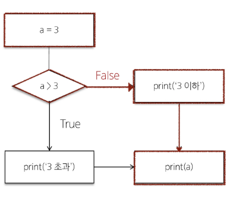

# 제어문

# 1. 개요

- 제어문(Contol Statement)
- 코드의 실행 흐름을 제어하는 데 사용되는 구문
- 조건에 따라 코드 블록을 실행하거나 반복적으로 코드를 실행
- 종류
    - 조건문  : if, elif, else
    - 반목문 : for, while
    - 반복문 제어 : break, continue, pass

# 2. 조건문(Conditional Statement)

- 주어진 조건식을 평가하여 해당 조건이 참(True)인 경우에만 코드 블록을 실행하거나 건너뜀
- **if / elif / else** : 파이썬 조건문에 사용되는 키워드

## 1) if statement의 기본 구조

```python
if 표현식:
	코드 블록
elif 표현식:
	코드 블록
else:
	코드 블록
```

- 조건문 예시

```python
a = 3

if a > 3:
	print('3 초과')
else:
	print('3 이하')
	
print(a) # 3 이하
```



## 2) 복수 조건문

- 조건식을 동시에 검사하는 것이 아니라 순차적으로 비교
⇒ 조건이 참인 경우 아래의 조건은 검사하지 않음
⇒ 만약, if를 두 번쓴다면 위 if문의 조건이 참이어도 아래 if문을 실행함

```python
dust = 35
    
    if dust > 150:
        print('매우 나쁨')
    elif dust > 80:
        print('나쁨')
    elif dust > 30:
        print('보통')
    else:
        print('좋음')
```

## 3) 중첩 조건문

```python
dust = 480

if dust > 150:
    print('매우 나쁨')
    if dust > 300:
        print('위험해요! 나가지 마세요!')
elif dust > 80:
    print('나쁨')
elif dust > 30:
    print('보통')
else:
    print('좋음')
```

# 3. 반복문(Loop Statement)

- 주어진 코드 블록을 여러 번 반복해서 실행하는 구문
- for : 특정 작업을 반복적으로 수행
- while : 주어진 조건이 참인 동안 반복해서 실행

## 1) for

- 임의의 시퀀스의 항목들을 그 시퀀스에 들어있는 순서대로 반복

### (1) for statement의 기본 구조

```python
for 변수 in 반복 가능한 객체:
	코드 블록
```

- 반복 가능한 객체(iterable)
    - 반복문에서 순회할 수 있는 객체
    - 시퀀스 객체 뿐만 아니라 dict, set 등도 포함

### (2) for문 작동 원리

- 리스트 내 첫 항목이 반복 변수에 할당되고 코드블록이 실행
- 다음으로 반복 변수에 리스트의 2번째 항목이 할당되고 코드블록이 다시 실행
- …마지막으로 반복 변수에 리스트의 마지막 요소가 할당되고 코드블록이 실행

```python
items = ['apple', 'banana', 'coconut']

for item in items:
	print(item)

# apple
# banana
# coconut
```

[style guide] 

for문 사용시 리스트에 복수형 반복시 사용할 변수명에 단수형

### (3) data type 별 순회

- 문자열 순회

```python
country = 'Koera'

for char in country:
	print(char)
# K
# o
# r
# e
# a
```

- range 순회

```python
for i in range(5):
	print(i)

# 0
# 1
# 2
# 3
# 4
```

- 딕셔너리 순회
    - 기본적으로 순회하면 key를 출력
    - value 출력할 경우 `딕셔너리[key]` 사용

```python
my_dict = {
    'x': 10,
    'y': 20,
    'z': 30,
}

for key in my_dict:
	print(key)
	print(my_dict[key])

# x
# 10
# y
# 20
# z
# 30	

```

- 인덱스로 리스트 순회
    - 길이`len()`를 이용해 range 사용

```python
numbers = [4, 6, 10, -8, 5]

for i in range(len(numbers)):
	numbers[i] = numbers[i] * 2
	
print(numbes) # [8, 12, 20, -16, 10]
```

### (4) 중첩된 반복문

- 안쪽 반복문은 outers 리스트의 각 항목에 대해 한번 씩 실행됨
- print가 호출되는 횟수⇒len(outers) * len(inners)

```python
outers = ['A', 'B']
inners = ['c', 'd']

for outer in outers:
	for inner in inners:
		print(outer, inner)

# A c
# A d
# B c
# B d
```

- 중첩된 리스트 순회
    - 안쪽 리스트 요소에 접근 하려면 바깥 리스트를 순회하면서 중첩 반복을 사용해 각 안쪽 반복을 순회

```python
elements = [['A', 'B'], ['c', 'd']]

for elem in elements:
	print(elem)
# ['A', 'B']
# ['c', 'd']
```

```python
elements = [['A', 'B'], ['c', 'd']]

for elem in elements:
	for item in elem:
		print(item)

# A
# B
# c
# d
```

## 2) while

- 주어진 조건식이 참(True)인 동안 코드를 반복해서 실행
==조건식이 거짓(False)가 될 때 까지 반복
- 반드시 **종료 조건**이 필요

### (1) while statement의 기본 구조

```python
while 조건식:
	코드 블록
```

- 예시

```python
a = 0

while a < 3:
	print(a)
	a += 1

print('끝')

"""
0
1
2
끝
"""
```

### (2) 사용자 입력에 따른 반복

- while문을 사용한 특정 입력 값에 대한 종료 조건 활용하기

```python
number = int(input('양의 정수를 입력해주세요.: '))
while number <= 0:
    if number < 0:
        print('음수를 입력했습니다.')
    else:
        print('0은 양의 정수가 아닙니다.')
    number = int(input('양의 정수를 입력해주세요.: '))
print('잘했습니다!')

"""
양의 정수를 입력해주세요.: 0
0은 양의 정수가 아닙니다.
양의 정수를 입력해주세요.: -1
음수를 입력했습니다.
양의 정수를 입력해주세요.: 1
잘했습니다!
"""
```

## 3) 적절한 반복문 활용하기

- for
    - 반복 횟수가 명확하게 정해져 있는 경우에 유용
    - 예를 들어 리스트, 튜플, 문자열 등과 같은 시퀀스 형식의 데이터를 처리할 때
- while
    - 반복 횟수가 불명확하거나 조건에 따라 반복을 종료해야 할 때 유용
    - 예를 들어 사용자의 입력을 받아서 특정 조건이 충족될 때까지 반복하는 경우

## 4) 반복 제어

- 반복문은 매 반복마다 본문 내 모든 코드를 실행하지만 때때로 일부만 실행하는 것이 필요할 때가 있음
- 키워드
    - break : 반복을 즉시 중지
    
    ```python
    for i in range(10):
    	if i == 5:
    		break
    	print(i) # 0 1 2 3 4
    ```
    
    - continue : 다음 반복으로 건너뜀
    
    ```python
    for i in range(10):
    	if i % 2 == 0:
    		continue
    	print(i) # 1 3 5 7 9
    ```
    
    - pass : 아무런 동작도 수행하지 않고 넘어감
    
    ```python
    for i in range(10):
    	pass # 아무 작업도 안함
    ```
    

### (1) break 예시

- 프로그램 종료 조건 만들기

```python
number = int(input('양의 정수를 입력해주세요.: '))
while number <= 0:
    if number == -9999:
        print('프로그램을 종료합니다.')
        break
    if number < 0:
        print('음수를 입력했습니다.')
    else:
        print('0은 양의 정수가 아닙니다.')
    number = int(input('양의 정수를 입력해주세요.: '))
print('잘했습니다!')

"""
양의 정수를 입력해주세요.: -9999
프로그램을 종료합니다.
잘했습니다!
"""
```

- 리스트에서 첫번째 짝수만 찾은 후 반복 종료하기

```python
numbers = [1, 3, 5, 6, 7, 9, 10, 11]
found_even = False

for num in numbers:
	if num % 2 == 0:
		print('첫 번째 짝수를 찾았습니다:', num)
		found_even =True
		break
if not found_even:
	 print('짝수를 찾지 못했습니다')

# 첫 번째 짝수를 찾았습니다: 6
```

### (2) continue 예시

- 리스트에서 홀수만 출력하기
⇒ 현재 반복문에서 남은 코드를 건너뛰고 다음 반복으로 넘어감

```python
numbers = [1, 2, 3, 4, 5, 6, 7, 8, 9, 10]

for num in numbers:
	if num % 2 == 0:
		continue
	print(num)

"""
1
3
5
7
9
"""
```

### (3) pass 예시

- 코드 작성 중 미완성 부분
    - 구현해야 할 부분이 나중에 추가될 수 있고,
    코드를 컴파일하는 동안 오류가 발생하지 않음

```python
def my_function():
	pass
```

- 조건문에서 아무런 동작을 수행하지 않아야 할 때

```python
if condition:
	pass # 아무런 동작도 수행하지 않음
else:
	# 다른 동작 수행
```

- 무한 루프에서 조건이 충족되지 않을 때 pass를 사용하여 루프를 계속 진행하는 방법

```python
while True:
	if condition:
		break
	elif condition:
		pass # 루프 계속 진행
	else:
		print('..')
```

## 5) List Comprehension

- 간결하고 효율적인 리스트 생성 방법

### (1) List Comprehension 구조

```python
[expression for 변수 in iterable]

list(expression for 변수 in iteralbe)
```

```python
[expression for 변수 in iterable if 조건식]

list(expression for 변수 in iteralbe if 조건식)
```

### (2) List Comprehension 사용 전/후 비교

```python
numbers = [1, 2, 3, 4, 5]
squared_numbers = []

for num in numbers:
    squared_numbers.append(num**2)

print(squared_numbers) # [1, 4, 9, 16, 25]
```

```python
numbers = [1, 2, 3, 4, 5]

squared_numbers = [num**2 for num in numbers]

print(squared_numbers) # [1, 4, 9, 16, 25]
```

### (3) 활용 예시

- 2차원 배열 생성 시 (인접행렬 생성 시)

```python
data1 = [[0] * (5) for _ in range(5)]
print(data1)

data2 = [[0 for _ in range(5)] for _ in range(5)]
print(data2)

"""
 [[0, 0, 0, 0, 0],
  [0, 0, 0, 0, 0],
  [0, 0, 0, 0, 0],
  [0, 0, 0, 0, 0],
  [0, 0, 0, 0, 0]]
"""
```

> **Comprehension 을 남용하지 말자.**
> 

> *“Simple is better than complex”*
> 

> *“Keep it simple, stupid”*
> 

### [리스트를 생성하는 법]

```python
# 1. loop
result1 = []
for i in range(10):
    result1.append(i)

# 2. list comprehension
result2 = [i for i in range(10)]
# result2 = list(i for i in range(10))

# 3. map
result3 = list(map(lambda i: i, range(10)))
```

1. list comprehension

- 대부분의 경우 가장 빠르고 파이썬스러운(Pythonic) 방법

2. map

- 특정 상황(예: 기존 함수를 사용할 때)에서 리스트 컴프리헨션과 비슷하거나 약간 더 빠를 수 있음

3. loop

- 일반적으로 가장 느리다고 알려져 있지만, python 버전이 올라가면서 다른 방식과 비슷하거나 때로는 더 나은 결과를 보이기도 함
- 복잡한 로직이 필요한 경우에는 여전히 유용하게 사용될 수 있음

결론

- 성능 차이는 대부분의 경우 미미하므로, 코드의 가독성과 유지보수성을 고려하여 상황에 맞는 적절한 방법을 선택하는 것을 권장

# [참고] enumrate

- `enumerate(iterable, start=0)`
- iterable 객체의 각 요소에 대해 인덱스와 함께 반환하는 내장함수
- 예시
    
    ```python
    fruits = ['apple', 'banana', 'cherry']
    
    for index, fruit in enumerate(fruits):
    	print(f'인덱스 {index}: {fruit}')
    	
    """
    인덱스 0: apple
    인덱스 1: banan
    인덱스 2: cherry
    """
    
    for index, fruit in enumerate(fruits, 3):
    	print(f'인덱스 {index}: {fruit}')
    """
    인덱스 3: apple
    인덱스 4: banan
    인덱스 5: cherry
    """
    ```