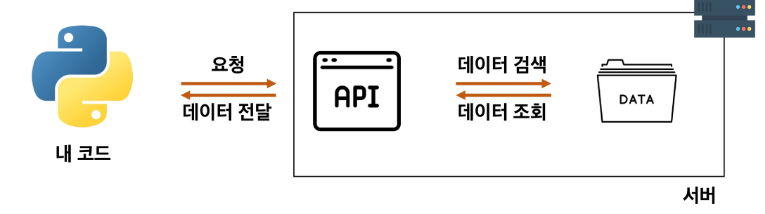

# 1일차

태그: 프로젝트

# 실습 목표

- 파이썬으로, 인터넷에 있는 날씨 정보를 가져와, 내가 원하는 정보만 출력

### 전문용어 이해하기

- 서버 : 부탁을 받으면 처리해주거나, 부탁대로 원하는 값을 돌려주는 역할
- 클라이언트 : 부탁하는 역할

⇒ 이번 프로젝트에서는 client가 server에게 날씨 정보 요청

### 클라이언트가 서버에 요청하는 두 가지 방법

- 웹 브라우저를 켜서 주소창에 주소를 입력
- 서버에 정보를 요청하는 코드를 작성
    - 파이썬은 requests를 이용하여 요청

### Requests

```python
import requests

url = 'https://fakestoreapi.com/carts'
data = requests.get(url).json()
print(data)
```

- url : 요청을 보내는 주소
- requests.get(url) : 해당 서버(url)에 데이터를 달라고 요청을 보내는 함수
- .json() : 내부 데이터를 JSON 형태로 변환해주는 함수

### API

- 클라이언트가 원하는 기능을 수행하기 위해서 서버 측에 만들어 놓은 프로그램
    - 기능 예시: 데이터 저장, 조회, 수정, 삭제 등등
- 서버 측에서 특정 주소로 요청이 오면 정해진 기능을 수행하는 API를 미리 만들어 둡니다.
    - 클라이언트가 서버가 미리 만들어 놓은 주소로 요청을 보냅니다.



### 오픈 API

- 외부에서 사용할 수 있도록 무료로 개방(OPEN) 된 API
- 사용법은 공식 문서(Docs) 에 명시되어 있습니다.
- 프로젝트에서 사용되는 API
    - OpenWeaterMap API: 기상 데이터 및 날씨 정보를 제공하는 오픈 API
    - 금융상픔통합비교공시 API : 금융감독원에서 제공하는 금융 상품 정보를 제공하는 오픈 API

### 오픈 API 특징 및 주의사항

- API KEY를 활용하여 사용자를 확인
    - 사용자 인증 혹은 회원가입을 하면 서버에서 API KEY를 발급
    - 서버에 요청할 때 마다 해당 API KEY를 함께 보내 정상적인 사용자인 것을 확인
- 일부 오픈 API는 사용량이 제한
    - 공식 문서의 일일 및 월간 사용량 제한을 반드시 확인
    - [주의] 사용량이 초과될 경우 요금이 청구될 수 있습니다.

### JSON

- API가 사용하는 데이터 형식
- JavaScript Object Notation(자바스크립트 객체 표기법) 의 약자.
- 데이터를 저장하거나 전송할 때 많이 사용되는 경량의 텍스트 기반의 데이터 형식
- 통신 방법이나 프로그래밍 문법이 아니라 단순히 데이터를 표현하는 표현 방법 중 하나
- 특징
    - 데이터는 중괄호 `{}` 로 둘러싸인 키-쌍 값의 집합으로 표현
    - 키 = 문자열 / 값 = 다양한 데이터 유형을 가질수 있음
    - 값은 쉼표 `,` 로 구분됨
- 참고
    - 파싱(Parsing): 데이터를 의미 있는 구조로 분석하고 해석하는 과정
    - json.loads(): JSON 형식의 문자열을 파싱하여python Dictionary 로 변환

# 실습

### 버전 1. 금융 상품 비교

- OpenWeatherMap API 활용하여 날씨 데이터 수집 및 가공
- 심화 : 정기 예금 데이터 수집 및 가공
    - [https://finlife.fss.or.kr/finlife/main/contents.do?menuNo=700029](https://finlife.fss.or.kr/finlife/main/contents.do?menuNo=700029)

### 버전 2. 영화 추천 서비스

- 파이썬으로 도서, 아티스트 데이터 가공