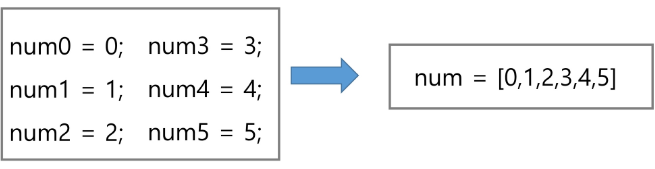

# List

# 1. 배열

## 1) 배열이란 무엇인가

- 일정한 자료형의 변수들을 하나의 이름으로 열거하여 사용하는 자료구조
- 6개의 변수를 사용해야 하는 경우, 이를 배열로 바꾸어 사용하는 예.
    
    
    

## 2) 배열의 필요성

- 프로그램 내에서 여러 개의 변수가 필요할 때, 일일이 다른 변수명을 이용하여 자료에 접근하는 것은 매우 비효율적일 수 있다.
- 배열을 사용하면 하나의 선언을 통해서 둘 이상의 변수를 선언할 수 있다.
- 단순히 다수의 변수 선언을 의미하는 것이 아니라, 다수의 변수로는 하기 힘든 작업을 배열을 활용해 쉽게 할 수 있다.

## 3) 1차원 배열

### (1) 1차원 배열의 선언

- 별도의 선언 방법이 없으면 변수에 처음 할당할 때 생성
- 이름 : 프로그램에서 사용할 배열의 이름
- 1차원 배열 선언의 예
    
    `Arr = list()`  `Arr = []`  `Arr = [1, 2, 3]`  `Arr = [0] * 10`
    

### (2) 1차원 배열의 접근

- `Arr[0] = 10` # 배열 Arr의 0번 원소에 10을 저장하라
- `Arr[idx] = 20` # 배열 Arr의 idx번 원소에 20을 저장하라

### (3) 입력받은 정수를 1차원 배열에 저장하는 방법

```python
# 첫 줄에 양수의 개수 N이 주어진다.(5<=N<=1000)
# 다음 줄에 빈칸으로 구분된 N개의 양수 Ai가 주어진다.(1<=Ai<=100000)
N = int(input())
arr = list(map(int, input().split()))
```

## 4) 연습 문제

**[min max]**

N개의 양의 정수에서 가장 큰 수와 가장 작은 수의 차이를 출력하시오.

**[입력]**

첫 줄에 테스트 케이스의 수 T가 주어진다. ( 1 ≤ T ≤ 50 )

각 케이스의 첫 줄에 양수의 개수 N이 주어진다. ( 5 ≤ N ≤ 1000 )

다음 줄에 N개의 양수 Ai가 주어진다. ( 1 ≤ Ai≤ 1000000 )

**[출력]**

각 줄마다 "#T" (T는 테스트 케이스 번호)를 출력한 뒤, 답을 출력한다.

```python
T = int(input())
for t in range(1, T+1):
    N = int(input())
    A = list(map(int, input().split()))
    max_v = A[0]
    min_v = A[0]
    for i in A:
        if i > max_v:
            max_v = i
        if i < min_v:
            min_v = i
    print(f'#{t} {max_v - min_v}')
```


```python
N = 9
arr1 = [7, 4, 2, 0, 0, 6, 0, 7, 0]
arr2 = [0 for _ in range(N)]
for i in range(N-1):
    cnt = 0
    if arr1[i]:
        for j in range(i+1, N):
            if arr1[i] > arr1[j]:
                cnt += 1
    arr2[i] = cnt
print(arr2)
```

# 2. 정렬

## 1) 대표적인 정렬의 종류

- 버블 정렬(Bubble Sort)
- 카운팅 정렬(Counting Sort)
- 선택 정렬(Selection Sort)
- 퀵 정렬(Quick Sort)
- 삽입 정렬(Insertion Sort)
- 병합 정렬(Merge Sort)

## 2) 버블 정렬

- 인접한 두 개의 원소를 비교하며 자리를 계속 교환하는 방식
- 정렬 과정
    - 첫 번째 원소부터 인접한 원소끼리 계속 자리를 교환하면서 맨 마지막 자리까지 이동한다.
    - 한 단계가 끝나면 가장 큰 원소가 마지막 자리로 정렬된다.
    - 교환하면 자리를 이동하는 모습이 물 위에 올라오는 거품 모양과 같다고 하여 버블 정렬이라고 한다.
- 시간 복잡도 - O(n**2)

```python
N = 5
a = [55, 7, 78, 12, 42]

for i in range(N):  # for i in range(N-1, 0, -1)
    for j in range(N-i-1):  # for j in range(0, i)
        if a[j] > a[j+1]:
            a[j], a[j+1] = a[j+1], a[j]
print(*a)
```