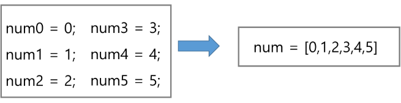

# List1

# 1. 배열

## 1) 배열이란 무엇인가

- 일정한 자료형의 변수들을 하나의 이름으로 열거하여 사용하는 자료구조
- 6개의 변수를 사용해야 하는 경우, 이를 배열로 바꾸어 사용하는 예.
    
    
    

## 2) 배열의 필요성

- 프로그램 내에서 여러 개의 변수가 필요할 때, 일일이 다른 변수명을 이용하여 자료에 접근하는 것은 매우 비효율적일 수 있다.
- 배열을 사용하면 하나의 선언을 통해서 둘 이상의 변수를 선언할 수 있다.
- 단순히 다수의 변수 선언을 의미하는 것이 아니라, 다수의 변수로는 하기 힘든 작업을 배열을 활용해 쉽게 할 수 있다.

## 3) 1차원 배열

### (1) 1차원 배열의 선언

- 별도의 선언 방법이 없으면 변수에 처음 할당할 때 생성
- 이름 : 프로그램에서 사용할 배열의 이름
- 1차원 배열 선언의 예
    
    `Arr = list()`  `Arr = []`  `Arr = [1, 2, 3]`  `Arr = [0] * 10`
    

### (2) 1차원 배열의 접근

- `Arr[0] = 10` # 배열 Arr의 0번 원소에 10을 저장하라
- `Arr[idx] = 20` # 배열 Arr의 idx번 원소에 20을 저장하라

### (3) 입력받은 정수를 1차원 배열에 저장하는 방법

```python
# 첫 줄에 양수의 개수 N이 주어진다.(5<=N<=1000)
# 다음 줄에 빈칸으로 구분된 N개의 양수 Ai가 주어진다.(1<=Ai<=100000)
N = int(input())
arr = list(map(int, input().split()))
```

## 4) 연습 문제

**[min max]**

N개의 양의 정수에서 가장 큰 수와 가장 작은 수의 차이를 출력하시오.

**[입력]**

첫 줄에 테스트 케이스의 수 T가 주어진다. ( 1 ≤ T ≤ 50 )

각 케이스의 첫 줄에 양수의 개수 N이 주어진다. ( 5 ≤ N ≤ 1000 )

다음 줄에 N개의 양수 Ai가 주어진다. ( 1 ≤ Ai≤ 1000000 )

**[출력]**

각 줄마다 "#T" (T는 테스트 케이스 번호)를 출력한 뒤, 답을 출력한다.

```python
T = int(input())
for t in range(1, T+1):
    N = int(input())
    A = list(map(int, input().split()))
    max_v = A[0]
    min_v = A[0]
    for i in A:
        if i > max_v:
            max_v = i
        if i < min_v:
            min_v = i
    print(f'#{t} {max_v - min_v}')
```


```python
N = 9
arr1 = [7, 4, 2, 0, 0, 6, 0, 7, 0]
arr2 = [0 for _ in range(N)]
for i in range(N-1):
    cnt = 0
    if arr1[i]:
        for j in range(i+1, N):
            if arr1[i] > arr1[j]:
                cnt += 1
    arr2[i] = cnt
print(arr2)
```

# 2. 정렬

## 1) 대표적인 정렬의 종류

- 버블 정렬(Bubble Sort)
- 카운팅 정렬(Counting Sort)
- 선택 정렬(Selection Sort)
- 퀵 정렬(Quick Sort)
- 삽입 정렬(Insertion Sort)
- 병합 정렬(Merge Sort)

## 2) 버블 정렬

- 인접한 두 개의 원소를 비교하며 자리를 계속 교환하는 방식
- 정렬 과정
    - 첫 번째 원소부터 인접한 원소끼리 계속 자리를 교환하면서 맨 마지막 자리까지 이동한다.
    - 한 단계가 끝나면 가장 큰 원소가 마지막 자리로 정렬된다.
    - 교환하면 자리를 이동하는 모습이 물 위에 올라오는 거품 모양과 같다고 하여 버블 정렬이라고 한다.
- 시간 복잡도 - O(n**2)

```python
N = 5
a = [55, 7, 78, 12, 42]

for i in range(N):  # for i in range(N-1, 0, -1)
    for j in range(N-i-1):  # for j in range(0, i)
        if a[j] > a[j+1]:
            a[j], a[j+1] = a[j+1], a[j]
print(*a)
```

## 3) 카운팅 정렬

- 항복들의 순서를 결정하기 위해 집합에 각 항목이 몇 개씩 있는지 세는 작업을 하여, 선형 시간에 정렬하는 *“효율적인 알고리즘”*
- 제한 사항
    - 정수나 정수로 표현할 수 있는 자료에 대해서만 적용 가능
    ⇒ 각 항목의 발생 회수를 기록하기 위해, 정수 항목으로 인덱스 되는 카운트들의 배열을 사용하기 때문
    - 카운트들을 위한 충분한 공간을 할당하려면 집합 내의 가장 큰 정수를 알아야함
- 시간 복잡도 - O(n+k) : n은 리스트 길이, k는 정수의 최댓값

### (1) 정렬 과정

- [0, 4, 1, 3, 1, 2, 4, 1]을 카운팅 정렬하는 과정
    - 1단계 : Data에서 각 항목들의 발생 회수를 세고, 정수 항목들로 직접 인덱스 되는 카운트 배열 counts에 저장한다.
        
        
        
        ```python
        data = [0, 4, 1, 3, 1, 2, 4, 1]
        counts = [0] * 5
        for num in data:
        		counts[num] += 1
        # [1, 3, 1, 1, 2] 
        ```
        
    - 2단계 : 정렬된 집합에서 각 항목의 앞에 위치할 항목의 개수를 반영하기 위해 counts의 원소를 조정한다.
        
        
        
        ```python
        for i in range(1, len(counts)):
            counts[i] += counts[i - 1]
        ```
        
    - 3단계 : data 를 뒤에서부터 순회하고 해당 counts의 값을 감소 시키고 Temp에 1을 삽입한다.
        
        
        
        
        
        ```python
        temp = [0] * len(data)
        for num in data[::-1]:
            counts[num] -= 1
            temp[counts[num]] = num
        ```
        

## **[참고**]


# 3. Baby-gin Game

- 설명
    - 0~9 사이의 숫자 카드에서 임의의 카드 6장을 뽑았을 때, 
    3장의 카드가 연속적인 번호를 갖는 경우를 run, 
    3장의 카드가 동일한 번호를 갖는 경우를 triplet이라고 한다.
    - 그리고, 6장의 카드가 run과 triplet로만 구성된 경우를  baby-gin으로 부른다.
    - 6자리의 숫자를 입력 받아 baby-gin 여부를 판단하는 프로그램을 작성하라.

## 1) 완전 검색(Exaustive Search)

- 모든 경우의 수를 나열해보고 확인하는 기법이다.
- Brute-force 혹은 generate-and-test 기법이라고도 불리 운다.
- 모든 경우의 수를 테스트한 후, 최종 해법을 도출한다.
- 일반적으로 경우의 수가 상대적으로 작을 때 유용하다.

### (1) 완전 검색을 활용한 Baby-gin 접근

- 고려할 수 있는 모든 경우의 수 생성하기
    - 6개의 숫자로 만들 수 있는 모든 숫자 나열(중복 포함)
- 해답 테스트 하기
    - 앞 3자리와 뒤 3자리를 잘라, run과 triplet 여부를 테스트하고 최종적으로 baby-gin을 판단

### (2) 순열을 어떻게 생성할 것인가

- 순열
    - 서로 다른 것들 중 몇 개를 뽑아서 한 줄로 나열하는 것
    - 서로 다른 n개 중 r개를 택하는 순열은 아래와 같이 표현한다. `nPr`
    - 그리고 nPr은 다음과 같은 식이 성립한다
        
        $nPr = n * (n-1) * (n-2) * ... * (n-r+1)$ 
        
    - nPn = n!이라고 표기하며 Factorial이라 부른다.
        
        $n! = n * (n-1) * (n-2) * ... * 2 * 1$
        
- 예시) {1, 2, 3}을 포함 하는 모든 순열을 생성하는 함수

```python
for i1 in range(1, 4):
    for i2 in range(1, 4):
        if i2 != i1:
            for i3 in range(1, 4):
                if i3 != i1 and i3 != i2:
                    print(i1, i2, i3)
```

## 2) 탐욕(Greedy) 알고리즘

- 최적해를 구하는 데 사용되는 근시안적인 방법
- 여러 경우 중 하나를 결정해야 할 때마다 그 순간에 최적이라고 생각되는 것을 선택해 나가는 방식으로 진행하여 최종적인 해답에 도달한다.
- 각 선택의 시점에서 이루어지는 결정은 지역적으로는 최적이지만,
그 선택들을 계속 수집하여 최종적인 해답을 만들었다고 하여,
그것이 최적이라는 보장은 없다.
- 일반적으로, 머릿속에 떠오르는 생각을 검증 없이 바로 구현하면 Greedy 접근이 된다.

### (1) 탐욕 알고리즘의 동작 과정

1. 해 선택 : 현재 상태에서 부분 문제의 최적 해를 구한 뒤, 이를 부분 집합(Solution Set)에 추가
2. 실행 가능성 검사 : 새로운 부분해 집합이 실행 가능한지를 확인한다. 곧, 문제의 제약 조건을 위반하지 않는지를 검사한다.
3. 해 검사 : 새로운 부분해 집합이 문제의 해가 되는지를 확인한다.

⇒ 아직 전체 문제의 해가 완성되지 않았다면 1.의 해 선택부터 다시 시작한다.

### (2) 거스름돈 줄이기

- “어떻게 하면 손님에게 거스름돈으로 주는 지폐와 동전의 개수를 최소한으로 줄일 수 있을까?”
1. 해 선택
    1. 여기에서는 멀리 내다볼 것 없이 가장 좋은 해를 선택한다.
    2. 단위가 큰 동전으로만 거스름돈을 만들면 동전의 개수가 줄어들므로 현재 고를 수 있는 가장 단위가 큰 동전을 하나 골라 거스름돈에 추가한다.
2. 실행 가능성 검사
    1. 거스름돈이 손님에게 내드려야 할 액수를  초과하는지 확인한다.
    2. 초과한다면 마지막에 추가한 동전을 거스름돈에서 빼고, 1. 로 돌아가서 현재보다 한 단계 작은 단위의 동전을 추가한다.
3. 해 검사
    1. 거스름돈 문제의 해는 당연히 거스름돈이 손님에게 내드려야 하는 액수와 일치하는 셈이다.
    2. 더 드려도, 덜 드려도 안되기 때문에 거스름돈을 확인해서 액수에 모자라면 다시 1. 로 돌아가서 거스름돈에 추가할 동전을 고른다.

### (3) Baby-gin을 완전검색이 아닌 방법으로 풀어보자

- 6개의 숫자는 6자리의 정수 값으로 입력된다.
- counts 배열의 각 원소를 체그하여 run과 triplet 및 baby-gin 여부를 판단한다.

```python
def baby_gin(number):
    counts = [0] * 12  # run 검사 시 IndexError 발생 방지
    #  0~9 까지의 숫자의 개수를 count
    for n in str(number):
        counts[int(n)] += 1
    # triplet 과 run 을 확인하기 위한 변수
    triplet = run = 0
    # triplet 과 run 을 검출하지 못할 경우를 생각해 while 문 사용하여 반복
    i = 0
    while i < 10:
        # triplet 검출 시 해당 인덱스를 다시 검사하도록 continue 문 사용
        if counts[i] >= 3:
            counts[i] -= 3
            triplet += 1
            continue
        # run 검출 시 해당 인덱스를 다시 검사하도록 continue 문 사용
        if counts[i] >= 1 and counts[i + 1] >= 1 and counts[i + 2]:
            counts[i] -= 1
            counts[i - 1] -= 1
            counts[i - 2] -= 1
            run += 1
            continue
        # 검출하지 못한 경우에만 i 증가
        i += 1
    return 'baby-gin' if triplet + run == 2 else 'lose'

num_list = [644544, 123123, 235777]
for num in num_list:
    print(baby_gin(num))
```

- 자주 실수하는 오답
    - 입력받은 숫자를 정렬한 후, 앞뒤 3자리씩 끊어서 run 및 triplet을 확인하는 방법을 고려할 수도 있다.
        - [6, 4, 4, 5, 4, 4] ⇒ 정렬하여 [4, 4, 4, 4, 5, 6]을 얻어내면 쉽게 baby-gin을 확인할 수 있다.
        - [1, 2, 3, 1, 2, 3] ⇒ 정렬하면 [1, 1, 2, 2, 3, 3]으로 오히려 baby-gin 확인을 실패할 수 있다.