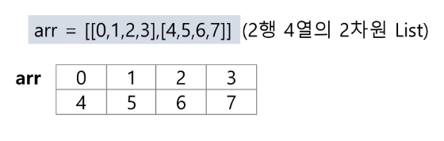

# List2

# 1. 2차원 배열

## 1) 2차원 배열의 선언

- 1차원 List를 묶어놓은 List
- 2차원 이상의 다차원 List는 차원에 따라 Index를 선언
- 2차원 List의 선언 : 세로길이(행의 개수), 가로길이(열의 개수)를 필요로 함
- Python 에서는 데이터 초기화를 통해 변수선언과 초기화가 가능함
    
    
    

## 2) 2차원 배열 순회

- n x m 배열의 n*m개의 원소를 빠짐없이 조사하는 방법

### (1) 행 우선 순회

```python
# i 행의 좌표
# j 열의 좌표
for i in range(n):
		for  j in range(m):
				print(array[i][j]) # 필요한 연산 수행
```

### (2) 열 우선 순회

```python
# i 행의 좌표
# j 열의 좌표
for j in range(m):
		for i in range(n):
				print(array[i][j]) # 필요한 연산 수행
```

### (3) 지그재그 순회

```python
# i 행의 좌표
# j 열의 좌표
for i in range(n):
		for j in range(m):
				print(array[i[j + (m-1-2*j) * (i%2)]) # 필요한 연산 수행
```

### (4) 델타를 이용한 2차원 배열 탐색

- 2차원 배열의 한 좌표에서 4방향의 인접 배열 요소를 탐색하는 방법
- 인덱스(i, j)인 칸의 상하좌우 칸(ni, nj)


```python
arr = [[0 for _ in range(n)] for _ in range(n)] # n*n 배열
di = [0, 1, 0, -1]
dj = [1, 0, -1, 0]
for i in range(n):
		for j in range(n):
				for k in range(4):
						ni = i + di[k]
						nj = j + di[k]
						if 0 <= ni < N and 0 <= nj < N # 유효한 인덱스면
								print(arr[ni][nj])
```

### (5) 전치 행렬


```python
arr = [[1, 2, 3], [4, 5, 6], [7, 8, 9]] # 3*3 행렬

for i in range(3):
		for j in range(3):
				if i < j:
						arr[i][j], arr[j][i] = arr[j][i], arr[i][j]
```

**[참고] i, j의 크기에 따라 접근하는 원소 비교**


## 3) 연습문제

### (1) 5x5 배열의 대각선 원소 합을 구하기

```python
arr = [[5*i+j for j in range(1, 6)] for i in range(5)]
num_sum = 0
for i in range(5):
    num_sum += arr[i][i] + arr[i][-1 - i]
num_sum -= arr[2][2]
print(num_sum)
```

### (2) 5x5 배열의 각 요소의 인접 요소와의 차의 절대 값의 총합

```python
arr = [[5*i+j for j in range(1, 6)] for i in range(5)]
di = [0, 1, 0, -1]
dj = [1, 0, -1, 0]
total = 0
for i in range(5):
    for j in range(5):
        s = 0
        for k in range(4):
            ni = i + di[k]
            nj = j + di[k]
            if 0 <= ni < 5 and 0 <= nj < 5:
                s += abs(arr[i][j] - arr[ni][nj])
        total += s
print(total)
```

# 2.부분 집합 합(Subset Sum) 문제

- 유한 개의 정수로 이루어진 집합이 있을 때, 이 집합의 부분 집합 중에서 그 집합의 원소를 모두 더한 값이 0이 되는 경우가 있는지를 알아내는 문제
- 예를  들어, [-7, -3, -2, 5, 8] 라는 집합이 있을 때, [-3, -2, 5] 는 이 집합의 부분집합이면서 
(-3)+(-2)+5=0 이므로 이 경우의 답은 참이 된다.
- 완전검색 기법으로 부분집합 합 문제를 풀기 위해서는, 우선 집합의 모든 부분집합을 생성한 후에 각 부분집합의 합을 계산해야 한다.

## 1) 부분집합의 수

- 집합의 원소가 n개일 때, 공집합을 포함한 부분집하의 수는 2**n개이다.
- 이는 각 원소를 부분 집합에 포함시키거나 포함시키지 않는 2가지 경우를 모든 원소에 적용한 경우의 수와 같다.


```python
# 부분 집합 만들기
arr1 = [1, 2, 3, 4]
bit1 = [0] * len(arr1)

def mk_subset(arr, bit):
    new_arr = [" "] * len(arr)
    for i in range(len(arr)):
        if bit[i]:
            new_arr[i] = arr[i]
    return new_arr

for i in range(2):
    bit1[0] = i
    for j in range(2):
        bit1[1] = j
        for k in range(2):
            bit1[2] = k
            for l in range(2):
                bit1[3] = l
                print(mk_subset(arr1, bit1))
```

## 2) 비트 연산자


- 비트 연산자를 이용한 부분집합 만들기

```python
# 비트 연산자 사용
arr2 = [3, 6, 7, 1, 5, 4]
n = len(arr2)
for i in range(1 << n):
    for j in range(n):
        if i & (1 << j):
            print(arr2[j], end=" ")
    print()
print()
```

## 3) 연습문제

- 부분집합의 합이 0인 경우의 수

 

```python
# 부분 집합의 합 만들기
def check_subset_sum_zero(arr, n):
    count_zero = 0
    for i in range(1 << n):
        subset = []
        for j in range(n):
            if i & (1 << j):
                subset.append(arr[j])
        if subset != [] and sum(subset) == 0:
            count_zero += 1
    return count_zero
```

# 3. 검색

- 저장되어 있는 자료 중에서 원하는 항목을 찾는 작업
- 목적하는 탐색 키를 가진 항목을 찾는 것
    - 탐색 키(search key) : 자료를 구별하여 인식할 수 있는 키
- 검색의 종류
    - 순차 검색(sequential search)
    - 이진 검색(binary search)
    - 해쉬(hash)

## 1) 순차 검색

- 일렬로 되어 있는 자료를 순서대로 검색하는 방법
    - 가장 간단하고 직관적인 검색 방법
    - 배열이나 연결 리스트 등 순차구조로 구현된 자료구조에서 원하는 항목을 찾을 때 유용함
    - 알고리즘이 단순하여 구현이 쉽지만, 검색 대상의 수가 많은 경우에는 수행시간이 급격히 증가하여 비효율적임

### (1) 정렬되어 있지 않은 경우

- 검색 과정
    - 첫 번째 원소부터 순서대로 검색 대상과 키 값이 같은 원소가 있는지 비교하며 찾는다.
    - 키 값이 동일한 원소를 찾으면 그 원소의 인덱스를 반환한다.
    - 자료구조의 마지막에 이를 때까지 검색 대상을 찾지 못하면 검색 실패
    
    
    
    
    
- 찾고자 하는 원소의 순서에 따라 비교회수가 결정됨
    - 첫 번째 원소를 찾을 때는 1번 비교, 두 번째 원소를 찾을 때는 2번 비교
    - 정렬되지 않은 자료에서의 순차 검색의 평균 비교 회수
    (1/n)*(1+2+3+4+···+n)  =(n+1)/2
    - 시간 복잡도 : O(n)
- 구현 예

```python
def sequential_search(a, n, key):
		i = 0
		while i < n and a[i] != key:
				i += 1
		if i < n:
				return i
		else:
				return -1
```

### (2) 정렬되어 있는 경우

- 검색 과정
    - 자료가 오름차순으로 정렬된 상태에서 검색을 실시한다고 가정하자.
    - 자료를 순차적으로 검색하면서 키 값을 비교하여, 원소의 키 값이 검색 대상의 키 값보다 크면 찾는 원소가 없다는 것이므로 더 이상 검색하지 않고 검색을 종료한다.
    
    
    
    
    
- 찾고자 하는 원소의 순서에 따라 비교회수가 결정됨
    - 정렬이 되어있으므로, 검색 실패를 반환하는 경우 평균 비교 회수가 반드올 줄어든다.
    - 시간 복잡도 : O(n)
- 구현 예

```python
def sequential_search2(a, n, key):
		i = 0
		# 인덱스와 값을 같이 비교할 경우 인덱스를 먼저 비교
		while i < n and a[i] < key:
				i += 1
		if i < n and a[i] == key:
				return i
		else:
				return -1
```

## 2) 이진 검색

- 자료의 가운데 있는 항목의 키 값과 비교하여 다음 검색의 위치를 결정하고 검색을 계속 진행하는 방법
    - 목적 키를 찾을 때까지 이진 검색을 순환적으로 반복 수행함으로써 검색 범위를 반으로 줄여가면서 보다 빠르게 검색을 수행함
- 이진 검색을 하기 위해서는 자료가 정렬된 상태여야 한다.
    
    
    
    
    

### (1) 구현

- 검색 범위의 시작점과 종료점을 이용하여 검색을 반복 수행한다.
- 이진 검색의 경우,  자료에 삽입이나 삭제가 발생했을 때 배열의상태를 항상 정렬 상태로 유지하는 추가 작업이 필요하다.

```python
def binary_search(a, N, key):
		start = 0
		end = N - 1
		while start <= end:
				middle = (start + end)//2
				if a[middle] == key:  # 검색 성공
						return True
						
				elif a[middle] > key:
						end = middle - 1
				else:
						start = middle + 1
		return False  # 검색 실패
```

### (2) 재귀 함수 이용

- 아래와 같이 재귀 함수를 이용하여 이진 검색을 구현할 수도 있다.
- 재귀 함수에 대해서는 나중에 더 자세히 배우도록 한다.

```python
def binary_search2(a, low, high, key):
		if low > high: # 검색 실패
				return False
		else:
				middle = (low + high) // 2
				if key == a[middle]:  # 검색 성공
						return True
				elif key < a[middle]:
						return binary_search2(a, low, middle - 1, key)
				elif a[middle] < key:
						return binary_search2(a, middle + 1, high, key)
```

### (3) 인덱스

- 인덱스라는 용어는  Database에서 유래했으며, 테이블에 대한 동작 속도를 높여주는 자료 구조를 일컫는다.
- Database 분야가 아닌 곳에서는 Look up table 등의 용어를 사용하기도 한다.
- 인덱스를 저장하는데 필요한 디스크 공간은 보통 테이블을 저장하는데 필요한 디스크 공간보다 작다. 왜냐하면 보통 인덱스는 키-필드만 갖고 있고, 테이블의 다른 세부 항목들은 갖고 있지 않기 때문이다.
- 대량의 데이터를 매번 정렬하면, 프로그램의 반응은 느려질 수 밖에 없다.
이러한 대량 데이터의 성능 저하 문제를 해결하기 위해 배열 인덱스를 사용할 수 있다.

⇒  데이터베이스 인덱스는 이진 탐색 트리 구조로 되어있다.

# 4. 선택 정렬

- Selection Sort
- 주어진 자료들 중 가장 작은 값의 원소부터 차례대로 선택하여 위치를 교환하는 방식
    - 앞서 살펴본 셀렉션 알고리즘을 전체 자료에 적용한 것이다.
- 정렬 과정
    - 주어진 리스트 중에서 최소값을 찾는다.
    - 그 값을 리스트의 맨 앞에 위치한 값과 교환한다.
    - 맨 처음 위치를 제외한 나머지 리스틀 대상으로 위의 과정을 반복한다.
- 시간 복잡도 : O(n**2)

## 1) 정렬과정

1. 주어진 리스트에서 최소값을 찾는다
    
    
    
2. 리스트의 맨 앞에 위치한 값과 교환한다.
    
    
    
3. 미정렬 리스트에서 최소값을 찾는다.
    
    
    
4. 리스트의 맨 앞에 위치한 값과 교환한다.
    
    
    
5. 이하 반복
- 코드

```python
a = 정렬된 정수 배열
for i in range(N - 1):
		idx = i
		for j in range(i + 1, N):
				if a[idx] > a[j]:
						idx = j
		a[i], a[idx] = a[idx], a[i]
```

## 2) 셀렉션 알고리즘

- Selection Algorithm
- 저장되어 있는 자료로부터 k번째로 큰 혹은 작은 원소를 찾는 방법
    - 최솟값, 최댓값 혹은 중간값을 찾는 알고리즘을 의미하기도 한다.
- 선택 과정
    - 정렬 알고리즘을 이용하여 자료 정렬하기
    - 원하는 순서에 있는 원소 가져오기
- k 번째로 작은 원소를 찾는 알고리즘
    - 1번부터 k번째 까지 작은 원소를 찾아 정렬하고 배열의 k번째 반환
    - k가 비교적 작을 때 유용하며 O(kn)의 수행시간을 필요라 한다
    
    ```python
    def select(arr, k):
    		for i in range(0, k):
    				idx = i
    				for j in range(i + 1, len(arr)):
    						if arr[idx] > arr[j]:
    								idx = j
    				arr[i], arr[idx] = arr[idx], arr[i]
    ```
    

