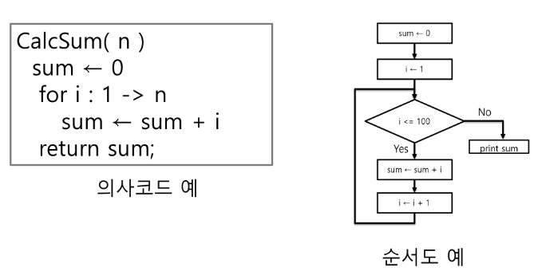

# 알고리즘_기초

**[참고] 과정 소개**

- 학습 내용
    - 자료구조와 알고리즘
- 학습 목표
    - 논리적 사고력 향상
    - 문제 해결 능력 향상
    
    ⇒  최종 목표는 연습 문제가 아닌 “현실 세계 문제”
    
- APS 기본 학습
    - 입출력을 제외한 내장함수 사용하지 않기
    - 기본적인 내장함수의 동작원리 이해

## 알고리즘

- 알고리즘 : 유한한 단계를 통해 문제를 해결하기 위한 절차나 방법이다.
주로 컴퓨터용어로 쓰이며, 컴퓨터가 어떤 일을 수행하기 위한 단계적 방법

      ⇒ 어떠한 문제를 해결하기 위한 절차

- 알고리즘을 표현 하는 방법 : 의사코드(슈도코드, Pseudocode)와 순서도
    
    
    
- 무엇이 좋은 알고리즘인가?
    - 정확성 : 얼마나 정확하게 동작하는가
    - 작업량 : 얼마나 적은 연산으로 원하는 결과를 얻어내는가
    - 메모리 사용량 : 얼마나 적은 메모리를 사용하는가
    - 단순성 : 얼마나 단순한가
    - 최적성 : 더 이상 개선할 여지없이 최적화되었는가
- 시간 복잡도 : 알고리즘의 작업량을 표현하는 방법
    - 실제 걸리는 시간을 측정
    - 실행되는 명령문의 개수를 계산
- 빅-오 표기법(Big-O Notation)
    - 시간 복잡도 함수 중에서 가장 큰 영향력을 주는  n에 대한 항만을 표시
    - 계수(Coefficient)는 생략하여 표시
    - n개의 데이터를 입력 받아 저장한 후 각 데이터에 1씩 증가시킨 후 각 데이터를 화면에 출력하는 알고리즘의 시간 복잡도는? O(n)
    
    